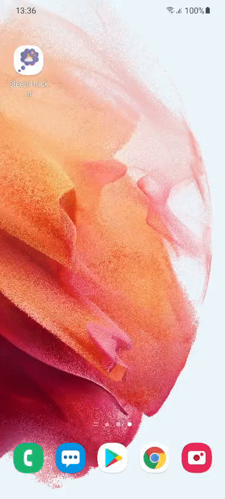

A nice, minimal android sleep tracker app with modern UI

-----

----

What i learned:

+ Create a responsive UI with ConstraintLayout
+ Date, time store with SharedPreferences
+ Calculating time elapsed
+ Progress Wheel
+ Swipe gesture

Design concept: https://dribbble.com/shots/16626501-Sleep-Tracker-App
